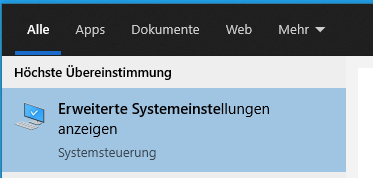
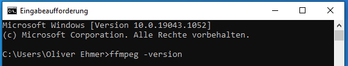

# English
## Windows
To install *FFmpeg* on *Windows* the program must be downloaded and its location must be specified in an environment variable. This is necessary so that FFmpeg can be started easily in the command prompt or terminal. The steps required for installation are explained below for *Windows 10*.

##### (1) Download
*FFmpeg* can be downloaded from the following site:
<https://github.com/BtbN/FFmpeg-Builds/releases>

On this site, *FFmpeg* is available for various operating systems and under several open source licenses. Be sure to download a .zip file that contains `win64` in the name, e.g. the following:

`ffmpeg-N-102754-g604924a069-win64-lgpl.zip`

If the above link does not work, an alternative link is available on the FFmpeg main page <https://ffmpeg.org/download.html>.

##### (2) Unzip
The .zip file will be located in your Downloads folder after downloading. Find the file and extract it. (Right click on the file > "Extract all...")

 

##### (3) Rename the folder
After unpacking, you will get a folder with the overall name of the original .zip file.

Inside it, there is a subfolder with the same name.
Rename this folder to ffmpeg (right click > "Rename".)

 

This folder has two subfolders named doc and `bin`. The `doc` folder contains documentation, the `bin` folder contains various program files, among them the file `ffmpeg.exe` .

 

##### (4) Move the folder
Move the newly renamed `ffmpeg` folder to the main level of your hard disk `C:\` .

To do this, first select the `ffmpeg` folder and press the key combination *CTRL + X* (to cut).

Then navigate to the main level of your hard disk `C:\` and press the key combination *CTRL + V* (to paste).

The folder `ffmpeg` should now be on the main level of the hard disk C:\ and the folder bin should be directly inside it.

(Note: You can also move the folder to another location, but then you will have to adjust the path accordingly in step (8)).

 

##### (5) Open Advanced System Properties
In the search bar next to the Start menu icon, type `Advanced System Properties`.

 

From the list of search results, select the “Advanced System Properties” app.

 

The „System properties“ window opens.

 

##### (6) Open environment variables
Select "Environment variables..." on this window.

 

The "Environment variables" window opens.

 

##### (7) Changing the "Path" variable
Click on the "Path" entry in the upper "User variables" area.
Then select "Edit...".

 

Another window opens.

 

Select the "New" command here.

One of the lines is then activated. Enter the following string: `C:\ffmpeg\bin`

 

(This is the path to the folder where the program ffmpeg.exe is located).

Click "OK”

Close the "Environment Variables" window with "OK”

Close the "System Properties" window with "OK”

##### (8) Testing the installation
In the search bar next to the Start menu icon, type “Command Prompt.”

 

Select the Command Prompt app from the list.

 

A terminal window will open.

 

Enter the following command: 

`ffmpeg -version`

 

If the installation was successful, you will receive the adjacent output with the version information.

 

If an error occurs, you will receive the adjacent message that *FFmpeg* could not be found. 

In this case, restart the computer and try the steps in (9) again.

If this does not help, check if the path in the environment variable "Path" is specified correctly and points to the folder where you saved `ffmpeg.exe` .

 

## macOS
For installation on *macOS* the package manager *homebrew* can be used. The following steps are necessary for installation.

##### (1) Installing XCode
*XCode* can be installed for free via the Apple AppStore.

 

##### (2) Installing homebrew
For installation, the terminal window in *RStudio* can be used. Alternatively, a separate Terminal window can be opened. The terminal is located in the Applications/Utilities folder of your Mac.

Enter the following command in the Terminal window to install *homebrew*.

`/bin/bash -c "$(curl -fsSL https://raw.githubusercontent.com/Homebrew/install/HEAD/install.sh)" `

**Attention:** Copy *both* lines of the command, it is only one command. It does not contain a line break, only spaces.

Then enter your account password and press Enter/Return.

You should get the following display. Press Enter/Return again.
 

Make sure that the installation is complete. It is only complete when the prompt appears again at the end of the process. 

##### (3) Installing *FFmpeg*
In the terminal, enter the following command: 

`brew install ffmpeg`

To update to a newer version of FFmpeg, you can use the following command:

`brew upgrade ffmpeg` 

##### (4) Testing the installation
To test whether the installation was successful, enter the following command in the terminal window:

`ffmpeg -version`

If multiple lines appear, the installation was successful.

# German

## Windows
Für die Installation von *FFmpeg* unter *Windows* muss das Programm heruntergeladen und darüber hinaus in einer Umgebungsvariable festgelegt werden, wo sich das Programm befindet. Dies ist notwendig, damit *FFmpeg* in der Eingabeaufforderung bzw. im Terminal einfach gestartet werden kann. Die hierfür notwendigen Schritte werden im Folgenden für *Windows 10* erläutert.

##### (1) Herunterladen
Auf der folgenden Seite kann *FFmpeg* heruntergeladen werden:

<https://github.com/BtbN/FFmpeg-Builds/releases>

Auf dieser Seite wird *FFmpeg* für verschiedene Betriebssysteme und unter verschiedenen Open Source-Lizenzen angeboten. Achten Sie darauf, dass Sie eine .zip-Datei laden, die `win64` im Namen enthält, z.B. die folgende:

`ffmpeg-N-102754-g604924a069-win64-lgpl.zip`

Sollte der oben angegebenen Link nicht funktionieren, ist auf der Hauptseite von *FFmpeg* ein alternativer Link verfügbar <https://ffmpeg.org/download.html>.
##### (2) Entpacken
Die .zip-Datei befindet sich nach dem Herunterladen in Ihrem Downloads Ordner. Finden Sie die Datei und entpacken Sie diese. (Rechtsklick auf die Datei > „Alle extrahieren...“)

 

##### (3) Umbenennen des Ordners
Nach dem Entpacken erhalten Sie einen Ordner mit dem Gesamtnamen der ursprünglichen .zip-Datei.
Darin befindet sich ein Unterordner, der denselben Namen trägt.

Benennen Sie diesen Ordner um in `ffmpeg` (Rechtsklick > „Umbenennen“

 

In diesem Ordner befinden sich zwei Unterordner mit den Namen `doc` und `bin`. Der Ordner doc enthält eine Dokumentation, der Ordner `bin` enthält verschiedene Programmdateien, unter diesen die Datei `ffmpeg.exe` .

 

##### (4) Verschieben des Ordners
Verschieben Sie den neu umbenannten Ordner `ffmpeg` auf die Hauptebene ihrer Festplatte `C:\` .

Wählen Sie hierzu zuerst den Ordner `ffmpeg` aus und drücken Sie die Tastenkombination *STRG + X* (zum Ausschneiden).

Navigieren Sie dann auf die Hauptebene Ihrer Festplatte `C:\` und drücken Sie die Tastenkombination *STRG + V* (zum Einfügen).

Danach müsste sich der Ordner ffmpeg auf der Hauptebene der Festplatte `C:\` befinden und direkt darin der Ordner `bin` enthalten sein.

(Anmerkung: Sie können den Ordner auch an eine andere Stelle verschieben, müssen in Schritt (8) dann aber den Pfad entsprechend anpassen.)

 

##### (5) Erweiterte Systemeinstellungen öffnen
Geben Sie in der Suchleiste neben dem Startmenüsymbol den Begriff `Erweiterte Systemeinstellungen` ein.

 

Klicken Sie in der Liste der Suchergebnisse auf die App „Erweiterte Systemeinstellungen“.

 

Es öffnet sich ein Fenster mit den „Systemeigenschaften“.

 

##### (6) Umgebungsvariablen öffnen
Wählen Sie in diesem Fenster „Umgebungsvariablen...“.

 

Es öffnet sich das Fenster „Umgebungsvariablen“.
 

##### (7) Verändern der Variable „Path“
Klicken Sie im oberen Bereich „Benutzervariablen“ auf den Eintrag „Path“.

Wählen Sie dann „Bearbeiten...“.

 

Es öffnet sich ein weiteres Fenster.

 

Wählen Sie hier den Befehl „Neu“.

Eine der Zeilen ist dann aktiviert. Tragen Sie hier die folgende Zeichenkette ein: 

`C:\ffmpeg\bin`
 

(Dies ist der Pfad zu dem Ordner, in dem das Programm `ffmpeg.exe` liegt.)

Klicken Sie auf „OK“

Schließen Sie das Fenster „Umgebungsvariablen“ mit „OK“

Schließen Sie das Fenster „Systemeigenschaften“ mit „OK“

##### (8) Testen der Installation
Geben Sie in der Suchleiste neben dem Startmenüsymbol den Begriff `Eingabeaufforderung` ein.

 

Klicken Sie auf die App „Eingabeaufforderung“ in der Liste.

 

Es öffnet sich ein Terminal-Fenster.

 

Geben Sie hier den folgenden Befehl ein:

`ffmpeg -version`

 

Wenn die Installation erfolgreich war, erhalten Sie die nebenstehende Ausgabe mit den Versionsinformationen. 
 

Bei einem Fehler erhalten Sie die nebenstehende Nachricht, dass *FFmpeg* nicht gefunden werden konnte. In diesem Fall starten Sie den Computer neu und versuchen Sie die Schritte unter (9) nochmals.

Wenn dies nicht hilft, prüfen Sie, ob der Pfad in der Umgebungsvariable „Path“ richtig angegeben ist und auf den Ordner zeigt, in dem sie die `ffmpeg.exe` gespeichert haben.

 

## macOS
Für die Installation unter *macOS* kann der Paketmanager *homebrew* genutzt werden. Zur Installation sind die folgenden Schritte notwendig.

##### (1) Installieren von XCode
*XCode* kann kostenlos über den Apple *AppStore* installiert werden.

 

##### (2) Installieren von homebrew
Zur Installation kann das Terminal-Fenster in *RStudio* genutzt werden. Alternativ kann ein separates Terminal-Fenster geöffnet werden. Das Terminal liegt im Ordner „Programme/Dienstprogramme“ Ihres Mac.

Geben Sie den folgenden Befehl in das Terminal-Fenster ein, um *homebrew* zu installieren.

`/bin/bash -c "$(curl -fsSL https://raw.githubusercontent.com/Homebrew/install/HEAD/install.sh)"`

**Achtung**: Kopieren Sie *beide* Zeilen des Befehls, es handelt sich nur um einen Befehl. Er enthält keinen Zeilenumbruch, sondern lediglich Leerzeichen.

Geben Sie dann das Passwort Ihres Accounts ein und drücken Sie Enter/Return.

Sie sollten die folgende Anzeige erhalten. Drücken Sie nochmals Enter/Return.
 

Achten Sie darauf, dass die Installation komplett erfolgt. Diese ist erst komplett, wenn am Ende des Prozesses wieder die Eingabeaufforderung erscheint. 

##### (3) Installieren von *FFmpeg*
Geben Sie im Terminal den folgenden Befehl ein:

`brew install ffmpeg`

Um ein Update auf eine neuere Version von *FFmpeg* zu machen, können Sie den folgenden Befehl nutzen:

`brew upgrade ffmpeg`

##### (4) Testen der Installation
Um zu testen, ob die Installation erfolgreich war, geben Sie im Terminal-Fenster den folgenden Befehl ein:

`ffmpeg -version`

Wenn mehrere Zeilen ausgegeben werden, war die Installation erfolgreich.

